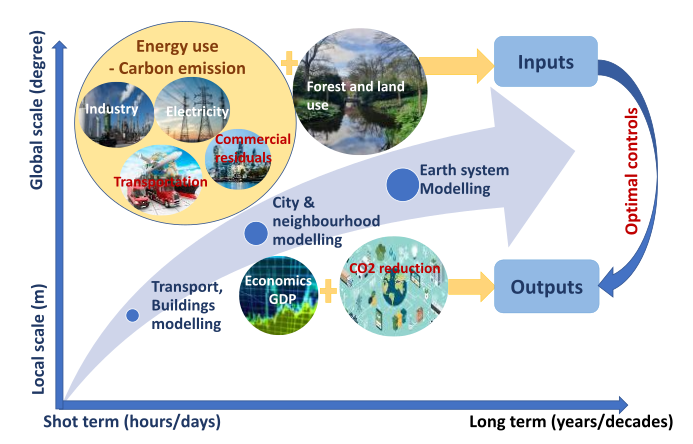
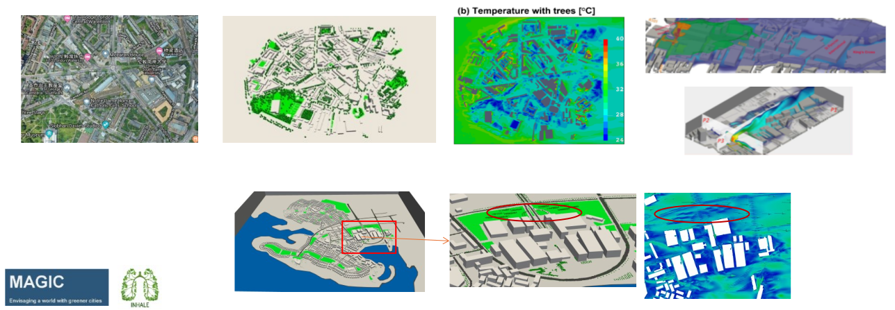
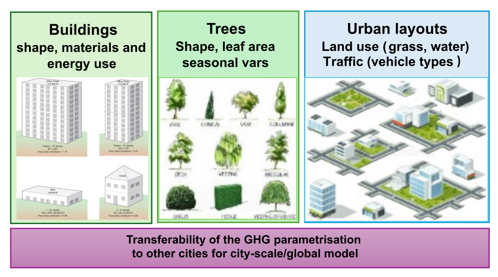
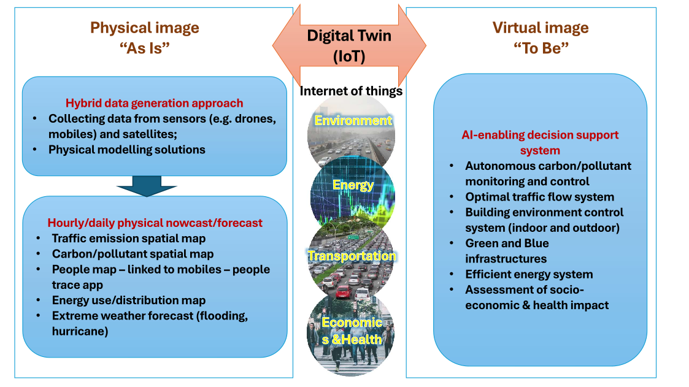
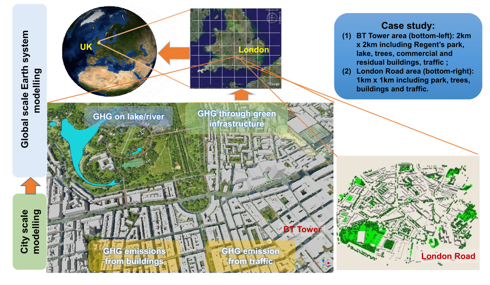

## Project Objective

This project aims to develop a hybrid AI and physics-informed modelling framework that
has the capability to: 

1. accurately assess carbon emissions
2. help design and manage
cities so that the carbon footprint is reduced
3. quantify the impact of urban carbon
emissions on global climate change by coupling with existing global ESMs. 

This innovative
framework will allow critical assessment of existing & new policy options on decarbonisation to be
carried out, thus improving local and global climate. The modelling framework will include low-carbon
schemes for urban infrastructures/city layouts, enabling a more accurate assessment of carbon
emissions, and their impacts on climate at street, neighbourhood, city, national and global scales,
by coupling models that focus on these different scales. This coupled framework will be used to
investigate these scientific questions:

1. How do anthropogenic carbon emissions affect local urban and global climate change?
2. Which optimal GI-BI, buildings, transportation, and sustainable city designs provide maximum
mitigation of carbon emissions & climate
change?
1. What is the trade-off between carbon
reduction, energy use and economics?
1. What are the feedback of the urban
carbon contribution to global climate?
1. How can detailed multi-scale models
provide efficient and accurate prediction of
carbon emissions and their impact on
climate change?

*Hybrid-AI and multiscale physical modelling for optimal control.*

## Work Package 1 (WP1)
### Multiscale physical carbon modelling in urban areas
*Aim: To develop an advanced multiscale model for improved accuracy of urban carbon modelling.* 

The work will be built on a multi-scale urban CFD model (Fluidity-Urban). The use of dynamically adaptive meshes enables the mesh resolution to focus on areas where important physical processes need to be captured. Physical models accounting for the urban carbon footprint will be developed and incorporated into the CFD model:
- Detailed city geometries
- Urban land surface and tree models
- Traffic modelling

#### Air quality modelling

*Air quality modelling (SO2) over 100 power plants.*

*Collaboration work with Institute of Atmospheric Physics, Chinese Academy of Sciences and Institute of Urban Environment, Chinese Academy of Sciences.*

*Air quality modelling (NO2 and O3) over 100 power plants.*

*Collaboration work with Institute of Atmospheric Physics, Chinese Academy of Sciences and Institute of Urban Environment, Chinese Academy of Sciences.*

#### Atmosphere modelling

    

        
    

    

        
    

*Atmosphere modelling. Left: cloud water mesh; right: rainwater structure.*

*Collaboration work with Institute of Atmospheric Physics, Chinese Academy of Sciences and Institute of Urban Environment, Chinese Academy of Sciences.*

#### Urban flow modelling

*Fluidity-Urban and 3D Urban Generator can model the airflow in urban areas, providing a high-resolution spatial distribution of pollutants or humidity. Courtesy of INHALE and MAGIC projects.*

## Work Package 2 (WP2)
### AI-based GHG parametrisation scheme in cities
*Aim: To develop an AI-based GHG parameterisation scheme that can provide an accurate assessment of the impact of city infrastructures on carbon emissions/reduction, thus accurately predicting the variability of CO2 surface fluxes monthly/seasonally/yearly.*

The multiscale carbon model developed in WP1 will be used for modelling carbon dispersion in different city scenarios. Here, we set up the geometries, GI-BI and associated surface fluxes, along with the formation of a database containing the physics associated with different plant species/ages. In this study, we mainly focus on sensitivity quantification of the impact of urban infrastructure configuration on decarbonisation:
- Effect of trees on decarbonisation
- Effect of land use on decarbonisation
- Development of an AI-based GHG parameterisation scheme

<!--  -->

*AI-based greenhouse gas parametrisation.*

## Work Package 3 (WP3)
### Digital tools for optimal control, design and management of city infrastructures
*Aim: To develop digital tools for the assessment of carbon emissions from city infrastructures, then provide optimal management for carbon reduction in existing cities and optimal design for future cities.*

- **Develop hybrid AI and physical modelling** for providing an interactive map of CO2 concentrations at a high spatial resolution
- **Digital tools for optimal control for low-carbon and resilient urban development**
  - Optimal locations of carbon filters and monitors within the city area
  - Optimal design of urban infrastructures using the integrated AI-based GHG and physical modelling framework
    1. Building design
    2. Optimal configuration of GI-BI
    3. Optimal traffic management

*Digital twin that links the physical world with a virtual image can help optimise urban design.*

## Work Package 4 (WP4)
### Case study at city-scale (London)
*Aims: (1) Assessment of carbon distribution and related energy use; (2) providing suggestions for carbon reduction via optimal infrastructure management and efficient use of energy; (3) Regression analysis of carbon distribution/emission and layout of city infrastructures.*

*Digital tools for Urban Environment Management: Integrated modelling from the neighbourhood, city to global scales showing the city GI-BI and human activities on local and global climate*

## Work Package 5 (WP5)
### Improved simulation of carbon cycle in global model
*Aims: (1) To improve the understanding of the interaction between anthropogenic carbon emission and climate change; (2) Assess the improvement of global climate change after carbon reduction through improving/optimising the existing/future infrastructures.*

## Work Package 6 (WP6)
### Dissemination and collaboration with the UK and International partners
*Aims: To provide an easy-to-access platform for capacity building and support for management; disseminate the results, outputs and case studies of the project, targeting, particularly decision makers; collaborate with our international partners.*

