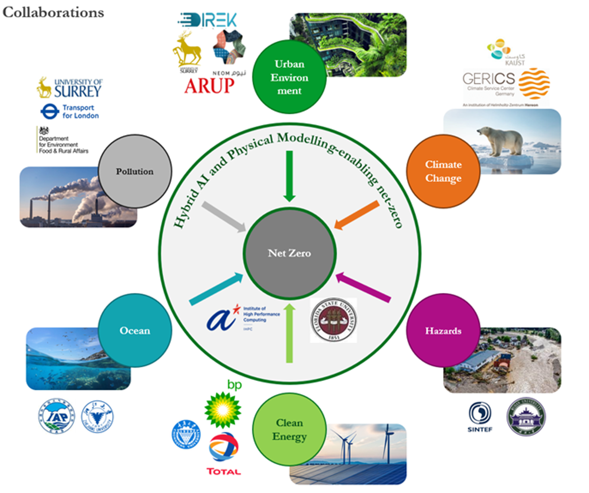

<!-- Content here would shop up above your list of posts -->
## Internal Collaboration at Imperial

- Applied Modelling and Computation Group, Department of Earth Science and Engineering: Prof. [Christopher Pain](https://profiles.imperial.ac.uk/c.pain)
- Department of Civil and Environmental Engineering: Dr. [Marc Stettler](https://profiles.imperial.ac.uk/m.stettler)
- [Environmental Research Group](https://www.imperial.ac.uk/school-public-health/environmental-research-group/), School of Public Health: Prof. [Frank Kelly](https://profiles.imperial.ac.uk/frank.kelly)
- [Imperial-X](https://ix.imperial.ac.uk/): Prof. [Peter Pietzuch](https://profiles.imperial.ac.uk/prp)
- Department of Physics: Dr [Heather Graven](https://profiles.imperial.ac.uk/h.graven)
- [Data Science Institute](https://www.imperial.ac.uk/data-science/)
- [Centre for Environmental Policy](https://www.imperial.ac.uk/environmental-policy/)
- [Grantham Institute – Climate Change and the Environment](https://www.imperial.ac.uk/grantham/)

## Domestic and Global Collaboration

*We work with domestic and global partners from both academia and industry.*
